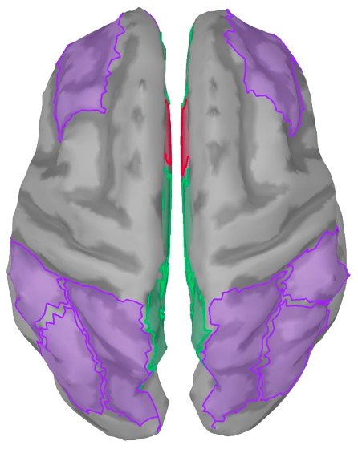

# EEG-Sensor-Connectivity-for-DMN
This repository is to do sensor based connectivity analysis which is done on data extracted from brainstorm (EEG matlab toolbox).

# Requiremnets
1. Matlab 2017 and above (Tested on Matlab 2021)
2. Fieldtrip toolbox can be downloaded for free.

# Brainstorm data
The sample data provided with this code is result of PLV or Coherence analyis that was run on Brainstorm. The data is in .mat extension which can be viewed in Matlab.

# Quick Start

1. Download the data and save it in a folder
2. Changing the loading path in STEP 1 for that folder
3. In this code based on the channel configration a DMN is defined based on 17 channel locations So at the end you should have a connectivity matrix named DMN.mat in each folder.
4. This DMN.mat from each folder is then loaded into STEP 2 which then performns cluster-based permutation using a feildtrip toolbox.

